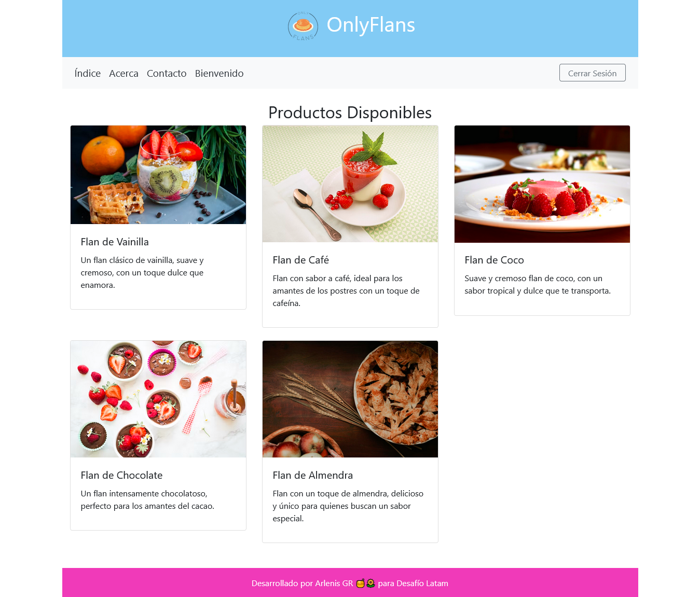

# Proyecto Django: OnlyFlans

OnlyFlans es una plataforma de venta de postres gourmet hechos a mano, diseñada para ofrecer a los amantes de los postres una experiencia simple y atractiva para explorar y ordenar postres personalizados y de alta calidad.

##  Problema

Hoy en día, muchas personas buscan opciones exclusivas y personalizadas para sus celebraciones, pero encontrar productos gourmet que sean únicos y de calidad puede ser un desafío. Además, los negocios locales de postres muchas veces carecen de una presencia en línea optimizada que facilite el pedido y el seguimiento de los productos.

##  Solución

OnlyFlans se presenta como una tienda en línea donde los usuarios pueden explorar una selección de postres hechos a mano, realizar pedidos de forma rápida y segura, y estar en contacto directo con el equipo de creación de OnlyFlans. La plataforma está desarrollada en Django y cuenta con una interfaz intuitiva, un formulario de contacto integrado y un sistema de autenticación que permite a los usuarios registrados acceder a funciones exclusivas, como una página de bienvenida personalizada.
Tecnologías utilizadas:

    Django para la gestión de usuarios y lógica del negocio
    Bootstrap para un diseño limpio y responsive
    SQLite como base de datos

##  Beneficios y Alcance

OnlyFlans aporta una experiencia digital amigable para los usuarios que buscan postres artesanales de calidad:

    Facilidad de pedido: Los usuarios pueden navegar y realizar pedidos en solo unos pocos clics.
    Experiencia personalizada: Los usuarios registrados reciben una bienvenida personalizada y una experiencia de usuario fluida y segura.
    Escalabilidad: La plataforma está diseñada para integrarse en un entorno de producción y permitir que más negocios locales puedan llevar sus productos al entorno en línea.

Estas ventajas ahorran tiempo y facilitan el acceso a opciones de postres únicos, en lugar de tener que visitar tiendas físicas o coordinar pedidos manualmente.

##  Capturas de Pantalla

Aquí hay algunas capturas de pantalla que muestran el funcionamiento de la plataforma:

    Página de Inicio
    

    Página de Bienvenida para Usuarios Registrados

    Formulario de Contacto

    Panel de Administración de Usuarios

##  Cierre y Llamado a la Acción

OnlyFlans está en constante evolución. Nos encantaría recibir tu retroalimentación para mejorar la experiencia de usuario y expandir las funcionalidades de la plataforma. ¡Te invitamos a explorar OnlyFlans, probar nuestra solución y contarnos cómo podemos llevar tu experiencia de postres en línea al siguiente nivel!

## Requisitos

- **Python 3.x**
- **Django**

## Instalación

### 1. Clona el repositorio:

   ```bash
   git clone https://github.com/tu-usuario/onlyflans.git
   ```

### 2. Crea y activa un entorno virtual:

   ```bash
   cd onlyflans
   python -m venv myenv
   ```

   **Activar el entorno virtual:**

   - En Windows:
     ```bash
     myenv\Scripts\activate
     ```

   - En macOS/Linux:
     ```bash
     source myenv/bin/activate
     ```

### 3. Instala las dependencias:

   ```bash
   pip install django
   ```

### 4. Ejecuta las migraciones:

   ```bash
   python manage.py migrate
   ```

### 5. Crea un usuario administrador para acceder al panel de administración:

   ```bash
   python manage.py createsuperuser
   ```

### 6. Ejecuta el servidor de desarrollo:

   ```bash
   python manage.py runserver
   ```

### 7. Accede a la aplicación:

   Abre tu navegador y visita [http://127.0.0.1:8000](http://127.0.0.1:8000) para ver la página principal de OnlyFlans.

## Estructura del Proyecto

La estructura básica del proyecto es la siguiente:

```
onlyflans/: Carpeta del proyecto principal.
    web/: Carpeta de la aplicación principal que contiene la lógica de OnlyFlans.
        templates/: Carpeta que contiene los templates HTML.
            web/: Carpeta con los templates específicos de la aplicación.
                index.html: Página de inicio.
                bienvenido.html: Página de bienvenida para usuarios autenticados.
                contacto.html: Formulario de contacto.
        static/: Archivos estáticos como CSS y JavaScript.
    manage.py: Archivo de gestión del proyecto Django.
```

## Uso del Proyecto

- **Página de Inicio**: Los usuarios pueden navegar por los productos disponibles.
- **Registro de Usuarios**: Permite crear una cuenta para acceder a opciones personalizadas.
- **Autenticación**: Iniciar sesión para ver una página de bienvenida personalizada.
- **Formulario de Contacto**: Los usuarios pueden enviar mensajes al equipo de OnlyFlans.
- **Panel de Administración**: Administradores pueden gestionar usuarios y contactos.

--- 
